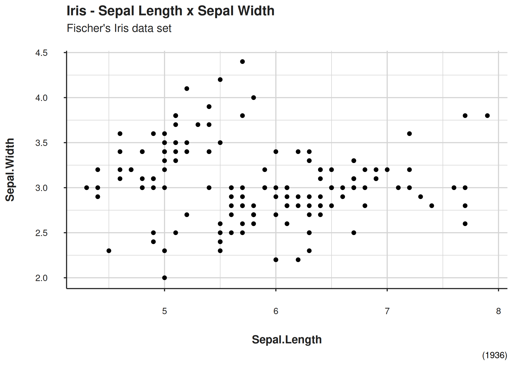
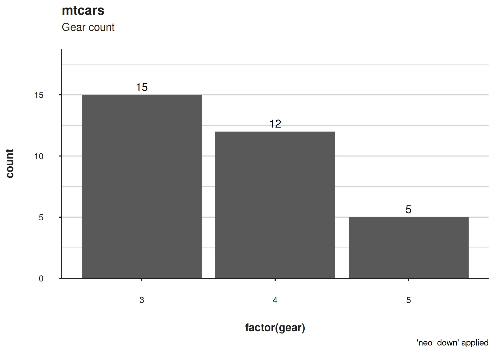

<!-- README.md is generated from README.Rmd. Please edit that file -->

# nelsonthemes 

<!-- badges: start -->

<!-- badges: end -->

The goal of nelsonthemes is to provide production-ready plot themes

## Installation

You can install the of nelsonthemes from
[GitHub](https://github.com/Nelson-DevStack/nelsonthemes) with:

``` r
# install.packages("devtools")
devtools::install_github("Nelson-DevStack/nelsonthemes)
```

## Usage

### Scatter plot

Basic example which shows you how to use the provided theme, `theme_neo`
with `layout` parameter from `nelsonthemes`.

``` r
library(nelsonthemes)
library(ggplot2)

# Scatter plot of Sepal.Length x Sepal.Width from Iris
ggplot(iris, aes(x = Sepal.Length, Sepal.Width)) +
  geom_point() +
  labs(
    title = "Iris - Sepal Length x Sepal Width",
    xlab = "Sepal Length",
    ylab = "Sepal Width",
    subtitle = "Fischer's Iris data set",
    caption = "(1936)"
  ) +
  theme_neo(layout = 4)
```



### Barplot

``` r
require(ggplot2)
ggplot(mtcars, aes(x=  factor(gear))) +
geom_bar() +
  geom_text(
    stat="count",
    aes(label = after_stat(count)),
    vjust = -0.3
  ) +
  labs(
    title = "mtcars",
    subtitle = "Gear count"
  ) +
  theme_neo()
```


Applying the `neo_down` function to attach the data to the x line
(bottom/down) and `layout = 4`:

``` r
require(ggplot2)
ggplot(mtcars, aes(x=  factor(gear))) +
geom_bar() +
  geom_text(
    stat="count",
    aes(label = after_stat(count)),
    vjust = -0.5
  ) +
  labs(
    title = "mtcars",
    subtitle = "Gear count",
    caption = "'neo_down' applied"
  ) +
  theme_neo(layout = 3) +
  neo_down()
```



### Time Series/Line chart

Recommended theme for time series: `theme_neo_x`

``` r
library(nelsonthemes)
library(ggplot2)

# Converting nhtemp time series object to data frame
nhtemp <- data.frame(nhtemp = nhtemp, year = 1912:1971)

# Time Series/Line chart
ggplot(nhtemp, aes(y = nhtemp, x = year)) +
  geom_line() +
  theme_neo_x() +
  labs(
    title = "Average Yearly Temperatures in New Haven",
    subtitle = "New Haven, Connecticut (1912-1971)",
    x = "Year",
    y = "Temperature"
  )
#> Don't know how to automatically pick scale for object of type <ts>. Defaulting
#> to continuous.
```


